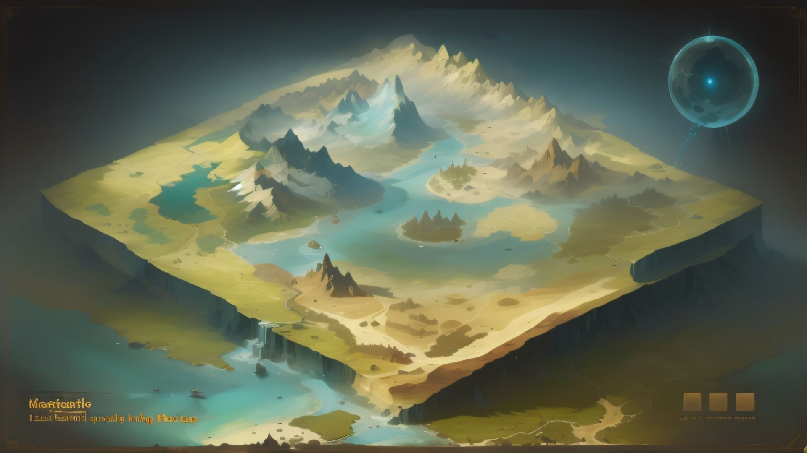

# [Game Name]



> [Brief one-sentence summary of the game.]

> [Get the Print & Play Files Here]([Link to your game's ZIP file or releases page])


- [[Game Name]](#game-name)
  - [Game Components](#game-components)
  - [Setup](#setup)
  - [How to Play](#how-to-play)
    - [Player Actions](#player-actions)
    - [Game Flow](#game-flow)
    - [Winning the Game](#winning-the-game)
  - [Card Anatomy](#card-anatomy)
  - [FAQ](#faq)
  - [Print & Play Instructions](#print--play-instructions)


---
## Game Components

* `1x` Rulebook
* `1x` Game Board
* `54x` Action Cards
* `4x` Player Pawns
* `20x` Resource Tokens (`10x` Gold, `10x` Wood)

---
## Setup

1.  Place the **Game Board** in the center of the table.
2.  Each player chooses a **Player Pawn** and places it on the "Start" space.
3.  Shuffle the `Action Card` deck and deal `5` cards to each player.
4.  Place the remaining `Action Card` deck face down to form a draw pile.
5.  The player who most recently [insert funny condition, e.g., "ate a vegetable"] goes first.

---
## How to Play

A game of `[Game Name]` is played over a series of rounds. On your turn, you will perform a series of actions.

### Player Actions

On your turn, you may perform **two** of the following actions:

-   **Move**: Move your `Player Pawn` up to `3` spaces.
-   **Draw a Card**: Draw `1` card from the `Action Card` deck.
-   **Play a Card**: Play one `Action Card` from your hand and resolve its effects.
    -   *Note: Some cards may count as a free action!* ### Game Flow

1.  The starting player takes their turn by performing two actions.
2.  Play proceeds clockwise to the next player.
3.  This continues until the end-game condition is met.

### Winning the Game

The game ends when one of the following conditions is met:
-   The first player to reach `25` Victory Points immediately wins!
-   If the `Action Card` deck runs out, the player with the most Victory Points at that time wins.

---
## Card Anatomy

| Component      | Icon | Description                                            |
| :------------- | :--: | :----------------------------------------------------- |
| **Cost** | `[C]`| The number of resources required to play this card.      |
| **Action** | `[A]`| The text describing the card's effect when played.     |
| **Flavor Text**| *“…”* | *Thematic text that adds to the world-building.* |
| **Victory Points**| `★` | Points this card is worth at the end of the game.    |


---
## FAQ

<details>
  <summary><strong>Can I play a defensive card on another player's turn?</strong></summary>
  
  Yes! Any card with the `[Reaction]` keyword can be played out of turn in response to the specified trigger.
</details>

<details>
  <summary><strong>What happens if two card effects contradict each other?</strong></summary>
  
  The effect of the card that was played most recently takes precedence. The "Last In, First Out" rule applies.
</details>

---
## Print & Play Instructions

1.  Download the latest release from the [link above](#get-the-print--play-files-here).
2.  Extract the `.zip` archive. Your folder structure should look like this:
    ```
    Print_and_Play/
    ├── Game_Board.pdf
    ├── Rulebook.pdf
    └── Cards/
        ├── Action_Cards_Page_1.pdf
        └── Action_Cards_Page_2.pdf
    ```
3.  Print all `.pdf` files at **100% scale** (do not "fit to page").
4.  Cut along the indicated lines. For best results, use 80-100lb card stock.

---
*This game was designed by []. Hope you enjoy it!*